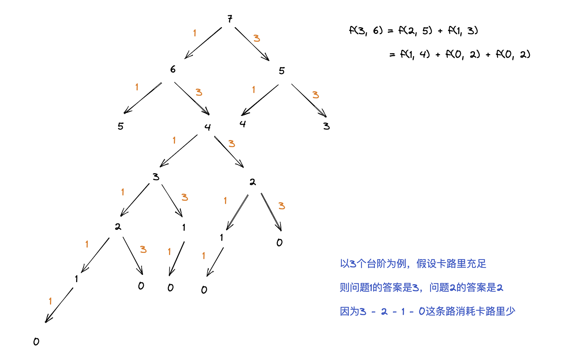
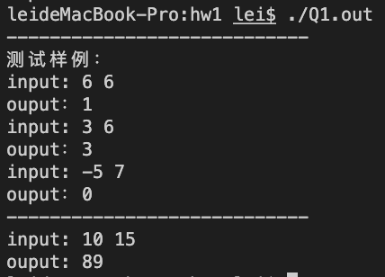
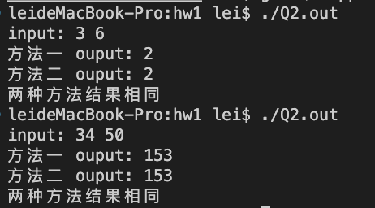

## 说明
编程题一共两问，解答分别在 `Q1.cpp` 和 `Q2.cpp` 中。
对于问题二，我给出了两种解法，方法一是基于编程角度，使用回溯算法来解决的，方法二则是基于数学方法，先用数学知识推导出函数关系式，再进行编程求解。

## 运行
```bash
g++ Q1.cpp -o Q1.out # 编译
./Q1.out # 运行

g++ Q2.cpp -o Q2.out 
./Q2.out
```

## 思路
### 问题一
经分析，这里存在一个递推关系，$F(m, n) = F(m - 1, n - 1) + F(m - 2, n - 3)$


走 m 节台阶、消耗 n 个卡路里有多少种情况取决于它的上一步，它的上一步可能是已经走到了第 m-1 节台阶，也可能是走到了第 m-2 节台阶，有且仅有这两种情况，所以把这两种情况加起来就是走 n 节台阶的所有可能情况。



接着寻找（递归）终止条件，结合上面的图片分析，当 m < 0 或 n < 0 或 m > n 时，这些情况均不存在；当 m = 0 并且 n >= 0 时，说明这是一种可行的情况。

有了终止条件和递归关系，最终用编程实现。

### 问题二
首先来说方法一，通过回溯算法来遍历所有可能的情况，然后再删除掉不符合条件的情况。具体来说，通过max_calories变量来记录消耗的卡路里最大数，一旦在接下来的遍历过程中发现有比max_calories大的情况出现，就及时更新max_calories，并且之前遍历过的全部情况都要去掉（因为之前存储的全部情况消耗的卡路里数都跟max_calories一样）；比max_colories小的情况不需要处理；如果和max_colories一样，那么说明找到了一条新的路径。当遍历完所有情况后，就可以得到最终的答案。

接着来说方法二，走一步消耗 1 卡路里，每次走两步消耗 3 卡路里，因此，为了消耗更多的卡路里，需要尽可能多走一次走两步。假设走了 x 个一步，y 个两步，可以列出一个方程组，如下。我们的目标是要求出 y 的最大整数值。
$$
x + 2y  = m \\
x + 3y \le n
$$

解得： $y \le n-m$

若 $y$ 可以取到 $n-m$，此时 $x = 3m - 2n$，总情况即为一次走一节和一次走两节的排列组合，故总共有 $C_{2m-n}^{n-m}$ 种情况；

下面讨论什么时候 y 可以取到 $n - m$，很显然，当 $n$ 比较小时，卡路里不够，极端情况时，卡路里数恰好够一直一次走两步，走完全程，即 $n = \frac{3}{2}m$。当 $n$ 小于 $\frac{3}{2}m$ 时，受制于 $n$ 限制，$y$ 只能取 $n - m$。

当 $n \geq \frac{3}{2}m$ 时，方程 $x + 3y \le n$ 失去作用，$y$ 最大取值为 $\lfloor {\frac{m}{2}} \rfloor$，对 $m$ 分奇偶进行讨论，当 $m$ 为偶数时，$y=\frac{m}{2}$，$x=0$，所以只有一种情况；当 $m$ 为奇数时，$y = \frac{m-1}{2}$，$x=1$，所以有 $C_{\frac{m+1}{2}}^{1} = \frac{m+1}{2}$ 种情况。

综上
$$
f(x)= 
\begin{cases} 
	C_{2m-n}^{n-m}  & n < \frac{3}{2}m \\
	1               & n \geq \frac{3}{2}m ~且 m为偶数 \\
	\frac{m+1}{2}   & n \geq \frac{3}{2}m ~且 m为奇数 \\
\end{cases}
$$

## 结果

### 问题一


### 问题二


