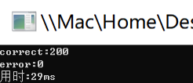

## 编程题 

编写一个高效的算法来搜索 m x n 矩阵 matrix 中的一个目标值 target。该矩阵具有以下特性:

每行的元素从左到右升序排列(matrix\[i][j] < matrix\[i][j+1])，每列的元素从上到下升序排列(matrix\[i][j] < matrix\[i+1][j]) 若能找到，返回 true, 若不能,返回 false。

请使用 C++，补充 test.cpp 文件中的函数并执行。

请简述算法思路并计算时间和空间复杂度，将补充的函数和执行结果都截图附在文档中。

### 算法思路

这道题最容易想到的肯定是暴力解法，即遍历整个矩阵，时间复杂度为 $O(mn)$，显然不是最优解法。

根据折半查找从中间开始比较，每次能缩少一半范围的思想，想到也可以寻找二维矩阵的中间值，右上角就是一个不错的选择（当然也可以选择左下角），通过和右上角的值进行比较，如果 target 大于这个值，说明 target 在当前值的右边或下边，又因为我们是从右往左找，所以只可能在下边，因此我们可以去下一行寻找，这样就排除了上一行；同理，如果 target 小于这个值，说明 target 在当前值的左边或上边，又因为我们是从上往下找，所以只可能在左边，因此可以去左边一列寻找，（因为我们是从右上角往右下角寻找，即从小到大，所以说明，如果 target 存在，那么 target 一定在这一行）；如果 target 等于这个值，那么显然我们找到了 target。

### 时间和空间复杂度

在列数 col 不发生改变之前，每次都可以消去一行，当列数 col--，说明如果 target 存在，那么我们锁定了 target 所在的行数，之后就只需要每次 col--就可以找到 target，即使 target 不存在，我们也只需要判断 n 次。

分析最坏情况，target 恰好在左下角或者说 target 不存在，那么我们最初会依次 row++，直到最后一行，再依次 col--，直到到达最后一行的第一个元素。所以最坏情况下，我们总共需要进行 m + n 次比较。

综上，时间复杂度为 $O(m + n)$。

除了几个变量外，没有使用额外空间，因此空间复杂度为 $O(1)$ 

### 代码

```C++
bool searchMatrix(vector<vector<int> >& matrix, int target){
    // TODO
    if (matrix.size() == 0)
        return false;
    // 从右上角开始寻找
    int row = 0;
    int col = matrix[0].size() - 1;
    while (row < matrix.size() && col >=0)
    {
        if (matrix[row][col] == target)
            return true;
        else if (matrix[row][col] > target) 
            col--;
        else // matrix[row][col] < target 消去一行
            row++;
    }
    return false;       
}
```

### 执行结果




坑：main() 函数中的文件读写程序不适用于 mac 系统电脑！相同的程序在 Windows 系统下结果是对的，在 mac 系统下有 bug。
